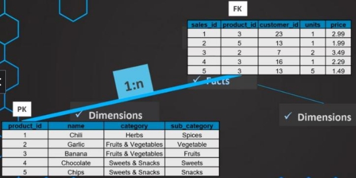
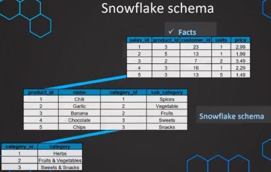

# Dimensional Modeling

Le dimensional modeling est une méthode d’organisation de la données dans un data warehouse, elles sont composées en deux élément lest facts (faits) et les dimension. Les fait sont composés de mesure (comme le profit) alors que les dimensions sont composées de catégories ou période.

Exemple :

- profit par an
- profit par catégories

étant donné la forme des interactions entre les table de faits et celle de de dimension qui ressemble à une étoile, on appelle ça le star schema.

Les objectif du dimensional modeling est :

- Augmentation de la performance
- Rendre le requêtage user-friendly

Exemple :

Ici, nous avons une table qui peut poser certains problèmes, nous avons par exemple la colonne name qui se répète et crée des lignes dupliquées ce qui peut réduire la performance du requêtage.

Étant donné que le customer\_id contient déjà l’information de qui est notre client, nous pouvons supprimer la colonne name

Le produit peut être considéré comme une catégorie, on peut donc créer une nouvelle table à laquelle on va associer une foreign key qui nous permettra de faire la jointure.

Nous avons donc une table de fait qui regroupe soit des foreign key soit des faits (mesure à un instant T) et une table de dimension avec des catégories est une primary key.

On peut faire la même chose pour une table de dimension de date, cela va nous permettre de faire des calcules plus simple comme le profit par mois.

Cette méthode est la plus utilisée pour la modélisation dans un data warehouse, elle est en conséquence très importante à comprendre.

## Facts

Faire la différence entre les fait et les dimensions ne sont pas forcément triviales, nous allons donc éclairissir ce point.

Pour rappel, la modélisation est la suivante :

Par exemple :

La table de fait est le centre de notre star schema, elle est composée des mesures importantes de notre entreprise, elle est la fondation de notre data warehouse. Ces faits sont ce que l’on veut agréger et/ou analyser par rapport à nos dimensions.

En général les fait sont additifs, ce qui veut que l’on peut les additionner entre eux, et donc numérique. Les faits ne sont pas descriptifs, mais mesurable, ils sont des événements ou transactionnels et les date sont souvent des composant de la table de faits.

Les tables de faits ont une caractéristique que l’on doit essayer de respecter au maximum qui s’appelle le grain, c’est le niveau le plus atomique possible, on doit faire en sorte que notre table reste à ce niveau.

## Dimensions

Les dimensions ont pour but de catégoriser les faits, cela implique que très souvent les données d’une table de dimensions sont catégorielles (opposé du numérique) au sens sémantique, elles sont très souvent utilisées pour filtrer, regrouper ou libellé nos données sur la table de fait.

Il y a d’autre caractéristique qui permette d’identifier si une colonne est une dimension ou non (En général, il peut y avoir des exceptions) :

- Les dimensions sont non aggrégeable (catégories, années…)
- Descriptifs (plutôt que mesurable)
- Statique (les catégories n’ont pas vocation à changer souvent voir pas du tout)

## Star schema

Le star schema est le schéma le plus utilisé dans le data warehouse, il est donc important de le comprendre en détail.

Comme on l’a vu, le star schéma est composé de d’une table de fait au milieu est de plusieurs table de fait qui l’entoure, la table de fait est relié aux tables de dimension par les foreign keys.

On a des relations 1:n ce qui signifie que pour un product\_id de la table de dimension, on peut avoir plusieurs ligne de la table de faits.

Comme on peut le voir sur la table de dimension, il peut y avoir des données redondantes (colonne catégorie) chocolate et chips appartiennent à la même catégorie, c’est parce qu’il n’y a un seul niveau de hiérarchies, c'est-à-dire qu’on ne recrée pas une table de dimension par-dessus la table de dimension pour éliminer cette redondance, on verra plus tard que l’on peut supprimer cette redondance avec le schéma snowflake.

Comme cette redondance existe, les données sont données sont vues comme “dénormalisé” mais les avantages de cette modélisation font qu’elle est tout de même très utilisé :

- Facilité à requêter les données
- performance de requêtage des données en lecture accrue
- user-friendly

Pour plus d’information sur la normalisation, aller au cours SQL.

## Snowflake schema

Le snowflake schema est une généralisation du star schéma, le star schéma est un snowflake schema mais avec un seul niveau de hiérarchies.

Le snowflake schéma n’as pas de limitation dans le niveau de hiérarchies ce qui permet d’avoir des données encore plus normalisées et ainsi réduire les redondances.

Si on compare les deux schéma, on a :

- Moins d’espace (coût de stockage réduit).
- Plus facile à maintenir et mettre à jour les données.
- Augmente la vitesse d’écritue

Cependant, il y a également des désavantage :

- Les requêtes sont plus complexes (plus de jointures)
- Moins performants en lecture

On préfère l’éviter vu que les OLAP sont conçus pour l’analyse (la lecture) mais dans le core/data warehouse s'il y a des problèmes

## Additivité

Dans la majorité des cas, les données d’une table de fait sont numériques et donc on peut les additionner, mais ce n’est pas toujours le cas.

- Données additives : les données qui peuvent être additionné dans peu importe la dimension
- Données semi-additive : les données qui peuvent additionner seulement avec un sous-ensemble de dimension
- Données non additives : les données qui ne peuvent pas être additionnées, quelle que soit la dimension

Exemple additif :

Ici, on peut faire un group by de unit peu importe la catégorie, il en va de même pour la date. Exemple semi-additif :

La données balance peut être additionné en fonction du portfolio, on peut compler le portfolio avec la date pour avoir une vision encore plus fine, mais on ne peut pas l’additionner en fonction de la date seule car même si techniquement cela est possible ça n’a pas de sens.

Exemple non additif :

Dans cet exemple le price n’est pas additif, en effet il y a des unité il faudrait multiplier le prix par les unité pour avoir le montant total qui serait une colonne additive.

## Null in fact

Quand nous avons null dans la majorité des cas ce n’est pas un problème car SQL sais comment les gérer quand nous voulons faire des agrégat.

Quelques fois, il peut être intéressant de remplacer null par 0, car si nous ne l’avions pas fait quand nous faisons la moyenne sur incoming, on obtient 50 alors qu’ici le sens de null est 0, si nous ne sommes pas sûrs de la valeur de null dans une colonne et qu’elle devrait être remplacée pour avoir plus de sens alors, nous devrions échanger avec les experts de ses données pour vérifier qu’il n’y a pas de problème

Il faut également faire attention aux foreing keys si elles sont null, il faut les renseigner avec une valeur qui n’est pas n’existe pas comme ça on créé un nouveau type.

## Year-to-date

C’est un type de requête très demandé par le métier pour avoir une vue temporelle et il n’est pas forcément trivial.

Il peut en voir pour chaque échelle temporelle (journalier, mensuelle, annuelle…), si on venait à tous les stocker, on aurait un problème de mémoire, en plus de ça nous ne serions plus à l’échelle des grain et nous violerons un principe de base des tables de faits.

La plupart du temps, les outtils de BI peuvent prendre en charge ce type de calcule il faut donc leur laisser la responsabilté à ces outils ce type de calcule et resté sur le format de données le plus fins (grain).

## Transactional fact table

Ce type de tables est le plus fondamental.

- Une ligne = un évenement/transaction
- Se place uniquement à une plage temporelle précise
- une transaction et le plus bas grain.
- Elles ont beaucoup de clé étrangère
- Très flexible
- souvent additive
- très commun
- Elles ont beaucoup de clé étrangère

Elles ont cependant un mauvais côté, c'est qu’elles s'agrandissent très vite et deviennent souvent énormes.

## Periodic fact table

- une ligne sommarisation de plusieurs événements/transaction pour une période donnée (1 heure, 1 jour, 1 mois…).
- La plus basse mesure temporelle devient automatiquement notre grain
- Beaucoup de mesure, peu de dimension
- Elle ne devient pas énorme et grandit de manière contrôlée.
- Elles sont généralement additives.
- Elles ont souvent beaucoup de fait et peu de dimension

## Accumulation snapshot fact table

- Une ligne sommarisation de plusieurs événements/transaction
- La sommarisation est la durée de vie du process (Ex : ordre de commande)
- Doit avoir une date de début et de fin.
- Elles ont souvent peu fait et beaucoup de dimension de type date
- Elle est peu commune

## Créer une fact table

4 considérations :

- Identifier le business process pour l’analyse.
- Déclarer le grain (Transaction, ordre, journalier etc.).
- Déterminer les dimensions qui sont importantes pour notre business scénario.
- Identifier les fait (mesure)

## Surrogate keys

Il peut y avoir des moment où les primary key d’un jeu de données ne sont pas très simple ou explicite pour notre usecase, dans ce cas de figure nous utilisons ce qu’on appelle une surrogate key.

Une sorragate key est une clé artificielle que nous créons pour faciliter notre travail.

Comme ces clés sont artificielles, il est suggéré de mettre un suffixe pour que l’ensemble de personne qui devront travailler avec puisse comprendre qu’elles ne sont pas issus de la table, on utilise dans le cours les suffixe \_PK ou \_FK.

les avantages sont :

- Les clés sont plus légères en mémoire
- Pour les jointure les valeurs numériques sont plus performante
- On peut remplacer beaucoup plus facilement les valeur NULL (999)
- Facile à gérer quand on a plein de données
- Des fois le table n’ont même pas de keys

## Dimension table

Comme les tables de faits, les table de dimension nécessite une clé primaire. L’une des best practice est de définir une surrogate key

Ces changement doivent être effectué sur les fact table pour permettre une jointure

## Date dimension

C’est le type de dimension le plus commun et aussi l’un des plus importants (si ce n’est pas le plus important) des dimensions, la surrogate key est la date souvent sous la forme YYYYMMDD. Pour les valeurs null, on remplace souvent les valeurs par 1900-01-01.

Il y a certaines règles qui peuvent aider et qui sont à valider avec le business :

- Format nombre et texte (ex : Janvier, 1).
- Long et abrégé (Jan, Janvier).
- Combinaison d’attributs (Q1, 2022-Q1).
- Date fiscal.
- Flags (Weekend, vacances, etc).

## Null in dimension

Les valeurs null doivent être évité à tout prix, pour les foreign keys, on peut utiliser une valeur que l’on présélectionne (999, -1).

 

Cependant en fonction des règles business les fait peuvent être accepté en tant que valeur null

Pour les table de dimension, en plus de la primary keys qui ne doit jamais être null, on doit également s’assurer que l’on remplace les valeurs null par une valeur descriptive pour que l’utilisateur puisse le comprendre.

## Hierachies in dimensions

Les données sont souvent normalisées, car elles apportent des avantages conséquents de mémoire et des bonnes performances d’écriture, cependant les data warehouse sont créées pour des hautes performances de lecture, c’est pourquoi la normalisation n’est pas recherché pour les dimension.

Nous devons chercher un format dénormalisé le plus possible les dimensions.

## Conformed dimension

Une conformed dimension est une dimension qui est utilisée par plusieurs table de faits en même temps.

Cette dimension permet de pouvoir comparer différent les différentes tables de faits entre elle, car elles sont liées.

## Slowly changing dimensions

C’est un terme des plus utilisés et populaire dans le monde du datawarehouse, les tables de dimension sont souvent static mais il peut arriver qu’elles changent le slowly change dimension est là pour gérer ce genre de cas.

Pour savoir si vous devrez mettre en place ce type de changement, vous devez :

- être proactif et demander s'il y aura des changement ou non
- Demander au métier, mais également les équipe IT
- Définir une stratégie pour chaque attribut

## Type 0

Cette méthode est la plus simple, elle consiste à ne pas modifier la table de dimension et suppose qu’il n’y a pas de changement, les date table sont fréquemment de bon candidat.

## Type 1

Dans ce type de slowing dimension les données sont modifiées directement dans la table de dimension si changement il y a.

étant donné que la key ne change pas, les modifications appliquées n’affecte pas la table de fait.

Cependant, il y a quelques problématique avec ce type :

- Il n’y a pas d’historique des changements
- Si des reportings sont connectés à la table, cela peut les affecter voir pire les casser (ex : case column)

## Type 2

Surement le type le plus utilisé, elle protège du problème du type 1 la perte de l’historique. Exemple type 1 :

Exemple type 2 :

Comme on peut le voir, on ajoute un nouveau type avec une nouvelle key, ce qui permettra de ne pas casser les anciennes requêtes qui cherchaient cette valeur et de mettre à jour les anciennes valeurs si besoin est.

Il peut arriver parfois que l’ajout d’un produit sur la table de dimension est une mise à jour, un nouvel utilisateur aurait du mal dans l’état à détecter si c’est le cas ou juste un nouveau produit, par ailleurs, on peut très bien demander une analyse sur une période spécifique sans prendre la modification en compte ou l’inverse.

Une des solutions retenues serait de stocker deux dates dans deux nouvelles colonnes, une colonnes qui indique le début de la mise en place du produit et une qui indique sa fin.

Une des best practices pour la date de fin d’un produit qui est toujours actif est de mettre une date très loin dans l’avenir (Ici, on a mis 2100-01-01).

Point d’attention : ici, on a deux key, la surrogate key(product\_PK/clé artificiel) et la primary key(Product\_id/ clé qui sert à identifier le produit) ces deux clé doivent toujours être conservé pour pouvoir comparer les produit et distinguer si c’est un ajout ou une mise à jour.

## Type 3

Le type 3 est un mix entre le type 1 et le type 2, il s’agit d’ajouter une colonne qui contiendra les anciennes valeurs, on évite donc d’ajouter une nouvelle ligne

elle est très utile quand il y a des changement significatif (restructuration de l’entreprise), mais si ce sont des changements imprévisibles et fréquents, il faut préférer le type 2.

Si cependant il venait à avoir une nouvelle valeur qui n’était pas présente dans le passé l’ajout de ligne est autorisé

Exemple sans nouvelle valeur :

Exemple avec nouvelle valeur :

